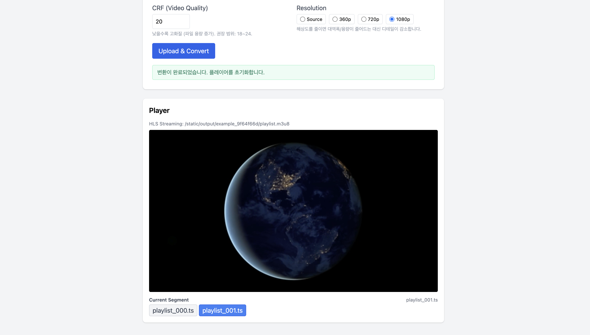

# Video Streaming Application

A web application for uploading video files and streaming them via HLS, MPEG‑DASH, or RTSP. The app focuses on packaging/transcoding, basic encoding control, and inspecting generated segments.

## Features

- 🎥 Upload MP4/MOV and other common video files
- 🔄 Multiple media formats for packaging (output layout):
  - **HLS**: `playlist.m3u8` + `*.ts` segments (MPEG‑TS)
  - **DASH**: `playlist.mpd` + fragmented MP4 segments (`*.m4s`, `init-*.mp4`)
  - **CMAF**: CMAF (Common Media Application Format) fragmented MP4 – common fMP4 assets that can be referenced from both HLS and DASH manifests
  - **RTSP (TS)**: MPEG‑TS over RTSP for low‑latency streaming
- 🌐 Streaming protocols:
  - HLS (HTTP Live Streaming)
  - MPEG‑DASH
  - RTSP (Real Time Streaming Protocol)
- 🎚️ Encoding controls per upload:
  - Segment duration (seconds) for HLS/DASH/CMAF
  - CRF for H.264 quality (lower = higher quality and larger file size)
  - Output resolution toggle (Source / 360p / 720p / 1080p)
- 🧭 Segment navigation UI:
  - Shows recently loaded HLS/DASH segments while playing
  - Click a segment badge to seek playback to that segment (approximate start time = index × segment duration)
- 📱 Responsive web interface



## Prerequisites

- Docker and Docker Compose (recommended)
- Or manually:
  - Python 3.7+
  - FFmpeg
  - Node.js and npm (for frontend dependencies)

## Docker Installation (Recommended)

1. **Clone the repository** (if not already done):
   ```bash
   git clone https://github.com/YebinLeee/Streaming_project.git
   cd Streaming_project
   ```

2. **Build and start the containers**:
   ```bash
   docker compose up --build
   ```

3. **Access the application**:
   - Web interface: http://localhost:8000
   - API documentation: http://localhost:8000/docs

4. **Stopping the application**:
   ```bash
   docker compose down
   ```

## Manual Installation

1. Clone the repository:
   ```bash
   git clone <repository-url>
   cd streaming-app
   ```

2. Install Python dependencies:
   ```bash
   pip install -r requirements.txt
   ```

3. Install FFmpeg:
   - On macOS: `brew install ffmpeg`
   - On Ubuntu/Debian: `sudo apt-get install ffmpeg`
   - On Windows: Download from [ffmpeg.org](https://ffmpeg.org/download.html)

## Running the Application

1. Start the FastAPI server:
   ```bash
   uvicorn main:app --reload
   ```

2. Open your browser and navigate to:
   ```
   http://localhost:8000
   ```

## Usage

1. **Upload Video**
   - Click "Choose File" to select a video file (MP4, MOV, etc.)
   - Select the desired **media format** (packaging layout):
     - `hls`  → HLS: `m3u8 + TS` segments
     - `dash` → DASH: `mpd + fMP4` segments
     - `cmaf` → CMAF‑based packaging (common fMP4 segments that can be referenced by HLS/DASH)
     - `ts`   → TS‑based packaging (internally uses the HLS pipeline, mainly combined with RTSP)
   - The compatible streaming protocols will be automatically enabled/disabled
   - Choose **Segment Duration** (seconds) for generated segments
   - Set **CRF** (video quality, typical range 18–24)
   - Choose **Resolution** (Source / 360p / 720p / 1080p)
   - Click **Upload & Convert** to start packaging and transcoding

2. **Playback Controls**
   - Use the player controls to play/pause the video
   - Adjust volume using the volume slider
   - Toggle fullscreen mode

3. **Resolution / Quality Control**
   - Effective output resolution and quality are determined at upload time by the selected **Resolution** and **CRF** values
   - Lower resolution and higher CRF values produce smaller files but lower visual quality

4. **Segment Navigation (HLS / DASH)**
   - While playing an HLS or MPEG‑DASH stream, the app displays the list of recently loaded segments under the player
   - The currently playing segment is highlighted
   - Click any segment badge to seek playback to that segment (approximate start time = segment index × segment duration)

## API Overview

- **Base URL**: `http://localhost:8000`
- **API base prefix**: `/api/v1`
- **Interactive docs (Swagger)**: `GET /docs`

### Upload API

| Field | Description |
|-------|-------------|
| **HTTP Method** | `POST` |
| **URL** | `/api/v1/upload/` |

| Request Body (form-data) | Description |
|--------------------------|-------------|
| `file` | Input video file (MP4, MOV, etc.), required |
| `media_format` | `hls` (m3u8/ts) \| `ts` (MPEG‑2 TS) \| `cmaf` (mpd/fMP4) \| `dash` (mpd/fMP4) |
| `streaming_protocol` | `hls` \| `dash` \| `rtsp` |
| `segment_duration` | Segment length in seconds (int, default: `6`) |
| `crf` | CRF for H.264 encoding (int, default: `20`) |
| `resolution` | `source` \| `360p` \| `720p` \| `1080p` |

| Success Response (200) | Description |
|------------------------|-------------|
| JSON | Response object containing: `task_id`, `status`, `output_path`, `stream_url`, `status_url` |

#### 예시 Request Body (multipart/form-data 개념 JSON 표현)

```json
{
  "file": "<binary MP4>",
  "media_format": "hls",
  "streaming_protocol": "hls",
  "segment_duration": 6,
  "crf": 20,
  "resolution": "source"
}
```

#### 예시 Success Response (200)

```json
{
  "task_id": 1,
  "status": "processing",
  "message": "Upload and conversion started",
  "output_path": "static/output/example_1234/playlist.m3u8",
  "stream_url": "/api/v1/stream/1",
  "status_url": "/api/v1/tasks/1"
}
```

### Task APIs

#### Get task status

| Field | Description |
|-------|-------------|
| **HTTP Method** | `GET` |
| **URL** | `/api/v1/tasks/{task_id}` |

| Path Params | Description |
|------------|-------------|
| `task_id` (int) | Upload/conversion task ID |

| Success Response (200) | Description |
|------------------------|-------------|
| JSON | `task_id`, `status`, `progress`, `error`, `stream_url` |

##### 예시 Response (200)

```json
{
  "task_id": 1,
  "status": "completed",
  "progress": 100,
  "error": null,
  "stream_url": "/api/v1/stream/1"
}
```

#### List tasks

| Field | Description |
|-------|-------------|
| **HTTP Method** | `GET` |
| **URL** | `/api/v1/tasks/` |

| Success Response (200) | Description |
|------------------------|-------------|
| JSON array | Each item contains: `task_id`, `status`, `filename`, `created_at` |

##### 예시 Response (200)

```json
[
  {
    "task_id": 1,
    "status": "completed",
    "filename": "example_1234.mp4",
    "created_at": "2025-11-21T01:23:45Z"
  },
  {
    "task_id": 2,
    "status": "processing",
    "filename": "sample_5678.mp4",
    "created_at": "2025-11-21T01:25:10Z"
  }
]
```

### Streaming APIs

#### Get stream info

| Field | Description |
|-------|-------------|
| **HTTP Method** | `GET` |
| **URL** | `/api/v1/stream/{task_id}` |

| Path Params | Description |
|------------|-------------|
| `task_id` (int) | Upload/conversion task ID |

| Success Response (200) | Description |
|------------------------|-------------|
| JSON | `hls_url`, `dash_url`, `rtsp_url`, `streaming_protocol` (`hls`/`dash`/`rtsp`), `status` |

##### 예시 Response (200)

```json
{
  "hls_url": "/static/output/example_1234/playlist.m3u8",
  "dash_url": null,
  "rtsp_url": null,
  "streaming_protocol": "hls",
  "status": "completed"
}
```

#### Get segment (chunk) file

| Field | Description |
|-------|-------------|
| **HTTP Method** | `GET` |
| **URL** | `/api/v1/chunks/{task_id}` |

| Path Params | Description |
|------------|-------------|
| `task_id` (int) | Upload/conversion task ID |

| Query Params | Description |
|-------------|-------------|
| `chunk_name` | File name (e.g., `playlist.m3u8`, `segment_000.ts`, `playlist.mpd`, etc.) |
| `chunk_type` | `hls` \| `dash` |

| Success Response (200) | Description |
|------------------------|-------------|
| File | The requested media chunk (`FileResponse`) |

#### Example query and response

- Example request:

```http
GET /api/v1/chunks/1?chunk_name=playlist.m3u8&chunk_type=hls
```

-- Response: HLS playlist text (`application/vnd.apple.mpegurl`)


## Media Format and Protocol Compatibility

> **Note**: `media_format` describes the output file layout (packaging),
> while `streaming_protocol` describes how the client accesses the stream (HLS/DASH/RTSP).

| Packaging format (by `media_format`) | HLS (HTTP) | MPEG‑DASH (HTTP) | RTSP |
|--------------------------------------|------------|------------------|------|
| HLS (`hls`) – `m3u8 + TS`            | ✔          | ✖                | ✖    |
| DASH (`dash`) – `mpd + fMP4`         | ✖          | ✔                | ✖    |
| TS (`ts`) – MPEG‑TS segments         | ✖          | ✖                | ✔*   |
| CMAF (`cmaf`) – CMAF fMP4 segments   | ✔ (usable by HLS) | ✔ (usable by DASH) | ✖ |

`*` TS format internally uses the HLS packaging pipeline in this project, but its primary usage is in combination with RTSP (MPEG‑TS over RTSP).

### RTSP Playback Example

- **Default RTSP port**: `8554` (configurable via `RTSP_PORT` environment variable)
- When you upload with `streaming_protocol=rtsp`, an internal FFmpeg RTSP server is started for the given stream.

#### Example RTSP URLs

- Local server:
  - `rtsp://localhost:8554/<stream_id>`
  - Example: `rtsp://localhost:8554/1`
- Remote server (e.g., `192.168.0.10`):
  - `rtsp://192.168.0.10:8554/<stream_id>`

`stream_id` is associated with the upload/conversion task and can be obtained from the `rtsp_url` field of `/api/v1/stream/{task_id}` when using RTSP.

#### How to open in VLC

1. Launch VLC
2. Open **Media → Open Network Stream...**
3. Enter the RTSP URL (e.g., `rtsp://localhost:8554/1`) in the "Network URL" field
4. Click **Play** to start RTSP playback

## Docker Configuration

The Docker setup includes:

- **Ports**:
  - `8000`: Web interface and API
  - `8554`: RTSP streaming port

- **Volumes**:
  - `./uploads`: Uploaded video files
  - `./static/output`: Processed streaming files

- **Environment Variables**:
  - `UPLOAD_DIR`: Directory for uploaded files (default: `/app/uploads`)
  - `OUTPUT_DIR`: Directory for processed files (default: `/app/static/output`)
  - `RTSP_PORT`: RTSP streaming port (default: `8554`)

## FFmpeg Command Details

This project uses FFmpeg in `services/video_converter.py` to convert uploaded files into HLS, DASH, and RTSP streams. The key commands and options are summarized below.

### HLS conversion (`_convert_to_hls`)

Conceptual command structure:

```bash
ffmpeg -y -i <input> \
  -c:v libx264 -preset veryfast -crf <crf> [ -vf scale=... ] \
  -c:a aac \
  -hls_time <segment_duration> \
  -hls_playlist_type vod \
  -hls_segment_filename playlist_%03d.ts \
  -hls_flags independent_segments \
  -start_number 0 \
  <output>.m3u8
```

- `-y`: Overwrite existing output files without asking
- `-c:v libx264`: Re‑encode video as H.264 (AVC)
- `-preset veryfast`: Encoding speed/efficiency trade‑off (fast preset for development/testing)
- `-crf <value>`: H.264 quality control (lower = higher quality and larger size, typical range 18–24)
- `-vf scale=...`: Change resolution based on the `resolution` setting (e.g., 360p/720p/1080p)
- `-c:a aac`: Encode audio as AAC
- `-hls_time`: Segment length in seconds (e.g., 6 → roughly 6‑second TS segments)
- `-hls_playlist_type vod`: VOD‑style HLS playlist
- `-hls_segment_filename`: Pattern for segment file names (e.g., `playlist_000.ts`)
- `-hls_flags independent_segments`: Force segment boundaries at independent GOPs for stable seeking/switching
- `-start_number 0`: Start segment numbering at 0

### DASH conversion (`_convert_to_dash`)

Conceptual command structure:

```bash
ffmpeg -y -i <input> \
  -map 0:v:0 -map 0:a:0 \
  -c:v libx264 -preset veryfast -crf <crf> [ -vf scale=... ] \
  -c:a aac \
  -f dash \
  -use_timeline 1 -use_template 1 \
  -seg_duration <segment_duration> \
  -frag_duration <segment_duration> \
  -window_size 5 \
  -adaptation_sets "id=0,streams=v id=1,streams=a" \
  -init_seg_name "init-stream$RepresentationID$.$ext$" \
  -media_seg_name "chunk-stream$RepresentationID$-$Number%05d$.$ext$" \
  <output>.mpd
```

- `-map 0:v:0 -map 0:a:0`: Explicitly select the first video and audio tracks
- `-c:v libx264`, `-preset`, `-crf`, `-vf`, `-c:a aac`: Same encoding settings as HLS
- `-f dash`: Output as MPEG‑DASH (MPD + fMP4 segments)
- `-use_timeline 1`, `-use_template 1`: Use timeline and template addressing in the MPD
- `-seg_duration`, `-frag_duration`: Segment/fragment duration in seconds
- `-window_size 5`: Sliding window size (more relevant for live, but usable for VOD as well)
- `-adaptation_sets`: Define separate AdaptationSets for video and audio
- `-init_seg_name`, `-media_seg_name`: File name patterns for init and media segments

### RTSP streaming (`_start_rtsp_stream`)

Conceptual command structure:

```bash
ffmpeg -re -stream_loop -1 -i <input> \
  -c:v libx264 -preset veryfast -tune zerolatency \
  -f rtsp rtsp://0.0.0.0:<RTSP_PORT>/<stream_id>
```

- `-re`: Read input at its native frame rate (approximate real‑time behavior)
- `-stream_loop -1`: Loop the input file indefinitely (useful for demo/testing)
- `-c:v libx264 -preset veryfast`: Real‑time H.264 encoding
- `-tune zerolatency`: Reduce latency by minimizing buffering
- `-f rtsp`: Output via RTSP protocol
- `rtsp://0.0.0.0:<port>/<stream_id>`: Bind the RTSP server to all interfaces inside the container

These options are tuned for a simple demo/development setup. In a production environment you would typically:

- Adjust `crf`, `preset`, and `resolution` to balance quality, bitrate, and CPU usage
- Extend the HLS/DASH pipelines with multiple resolutions/bitrates (ABR) using additional `-map`, `scale`, and, for HLS, `-var_stream_map` configurations

## Project Structure

- `main.py`: FastAPI application and API endpoints
- `templates/`: HTML templates
  - `index.html`: Main application interface
- `static/`: Static files (CSS, JS, output videos)
- `uploads/`: Temporary storage for uploaded files

## License

MIT
